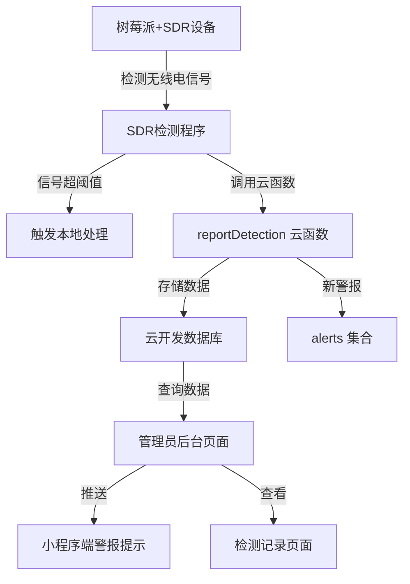

# 无人机信号检测系统设计

Feature Name: drone-detection
Updated: 2026-03-12

## Description

该功能实现无人机信号检测和预警系统。树莓派连接SDR（软件无线电）接收机监测无线电信号，当检测到无人机信号时，通过云函数上报至微信小程序云开发数据库，管理员可在小程序管理后台收到警报通知并查看检测记录。

## Architecture



## Components and Interfaces

### 1. 云函数: reportDetection

**功能**: 接收树莓派上报的检测数据

**请求参数**:
```javascript
{
  location_id: String,        // 监测点ID
  location_name: String,       // 监测点名称
  frequency: Number,           // 信号频率(MHz)
  signal_strength: Number,     // 信号强度(dBm)
  is_drone: Boolean,           // 是否判定为无人机信号
  timestamp: Number           // 时间戳（毫秒）
}
```

**响应**:
```javascript
{
  success: true,
  data: {
    record_id: "xxx",
    is_alert: true/false,
    message: "记录成功"
  }
}
```

### 2. 云函数: getDetectionRecords

**功能**: 获取检测记录（管理员用）

**请求参数**:
```javascript
{
  location_id: String,     // 可选，筛选监测点
  start_date: String,      // 可选，开始日期 YYYY-MM-DD
  end_date: String,       // 可选，结束日期 YYYY-MM-DD
  is_drone: Boolean,      // 可选，筛选是否无人机信号
  page: Number,           // 分页页码
  page_size: Number      // 每页数量
}
```

### 3. 云函数: getAlerts

**功能**: 获取警报列表

**请求参数**:
```javascript
{
  is_read: Boolean,       // 可选，筛选已读/未读
  is_handled: Boolean,   // 可选，筛选已处理/未处理
  page: Number,          // 分页页码
  page_size: Number      // 每页数量
}
```

**响应**:
```javascript
{
  success: true,
  data: {
    alerts: [...],
    unread_count: 10,
    total: 100
  }
}
```

### 4. 云函数: handleAlert

**功能**: 处理警报

**请求参数**:
```javascript
{
  alert_id: String,       // 警报ID
  action: String         // 操作: handle/ignore
}
```

### 5. 云函数: getLocations

**功能**: 获取监测点列表

**请求参数**:
```javascript
{
  status: String         // 可选，筛选状态 active/inactive
}
```

### 6. 云函数: addLocation / updateLocation / deleteLocation

**功能**: 管理监测点

### 7. 管理后台页面

**页面路径**: 
- `/pages/drone-alerts/drone-alerts` - 警报列表页面
- `/pages/detection-records/detection-records` - 检测记录页面
- `/pages/location-management/location-management` - 监测点管理页面

## Data Models

### drone_detection 集合

| 字段 | 类型 | 必填 | 说明 |
|------|------|------|------|
| _id | ObjectID | 是 | 自动生成 |
| location_id | String | 是 | 监测点ID |
| location_name | String | 是 | 监测点名称 |
| frequency | Number | 是 | 信号频率(MHz) |
| signal_strength | Number | 是 | 信号强度(dBm) |
| is_drone | Boolean | 是 | 是否判定为无人机信号 |
| alert_status | String | 否 | 警报状态: pending/handled/ignored |
| detected_at | Date | 是 | 检测时间 |
| handled_at | Date | 否 | 处理时间 |
| created_at | Date | 是 | 记录创建时间 |

### detection_locations 集合

| 字段 | 类型 | 必填 | 说明 |
|------|------|------|------|
| _id | ObjectID | 是 | 自动生成 |
| location_id | String | 是 | 监测点ID |
| location_name | String | 是 | 监测点名称 |
| location_desc | String | 否 | 位置描述 |
| frequency_min | Number | 是 | 监测频段最小值(MHz) |
| frequency_max | Number | 是 | 监测频段最大值(MHz) |
| threshold | Number | 是 | 信号判定阈值(dBm) |
| status | String | 是 | 状态: active/inactive |
| is_deleted | Boolean | 是 | 是否删除 |
| created_at | Date | 是 | 创建时间 |
| updated_at | Date | 是 | 更新时间 |

### alerts 集合

| 字段 | 类型 | 必填 | 说明 |
|------|------|------|------|
| _id | ObjectID | 是 | 自动生成 |
| detection_id | String | 是 | 检测记录ID |
| location_id | String | 是 | 监测点ID |
| location_name | String | 是 | 监测点名称 |
| frequency | Number | 是 | 信号频率 |
| signal_strength | Number | 是 | 信号强度 |
| is_read | Boolean | 是 | 是否已读 |
| is_handled | Boolean | 是 | 是否已处理 |
| handled_at | Date | 否 | 处理时间 |
| created_at | Date | 是 | 创建时间 |

## Database Indexes

```javascript
// drone_detection 集合索引
db.drone_detection.createIndex({ location_id: 1, detected_at: -1 })
db.drone_detection.createIndex({ is_drone: 1, detected_at: -1 })
db.drone_detection.createIndex({ detected_at: 1 })

// alerts 集合索引
db.alerts.createIndex({ is_read: 1, created_at: -1 })
db.alerts.createIndex({ is_handled: 1, created_at: -1 })

// detection_locations 集合索引
db.detection_locations.createIndex({ location_id: 1 }, { unique: true })
db.detection_locations.createIndex({ status: 1 })
```

## Error Handling

| 场景 | 处理方式 |
|------|----------|
| 数据格式不完整 | 返回错误信息，要求补充必要字段 |
| 监测点不存在 | 返回错误信息，提示先添加监测点 |
| 数据库写入失败 | 返回错误信息，记录日志 |
| 警报创建失败 | 记录日志，继续处理检测数据 |

## Test Strategy

### 单元测试
- 云函数输入验证
- 数据格式化逻辑

### 接口测试
- reportDetection 接口正常上报
- getDetectionRecords 接口筛选功能
- getAlerts 接口准确性

### 集成测试
- 树莓派完整上报流程
- 管理后台数据展示
- 警报推送流程

## Implementation Tasks

### 后端任务
1. [ ] 创建 reportDetection 云函数
2. [ ] 创建 getDetectionRecords 云函数
3. [ ] 创建 getAlerts 云函数
4. [ ] 创建 handleAlert 云函数
5. [ ] 创建 getLocations 云函数
6. [ ] 创建 addLocation 云函数
7. [ ] 创建 updateLocation 云函数
8. [ ] 创建 deleteLocation 云函数
9. [ ] 创建数据库集合和索引

### 前端任务
1. [ ] 创建 drone-alerts 警报页面
2. [ ] 创建 detection-records 检测记录页面
3. [ ] 创建 location-management 监测点管理页面
4. [ ] 在管理后台添加入口

### 设备对接
1. [ ] 编写树莓派SDR检测程序
2. [ ] 提供SDR对接文档

## References

- 微信小程序云开发文档: https://developers.weixin.qq.com/miniprogram/dev/wxcloud/
- RTL-SDR 相关文档: https://www.rtl-sdr.com/
