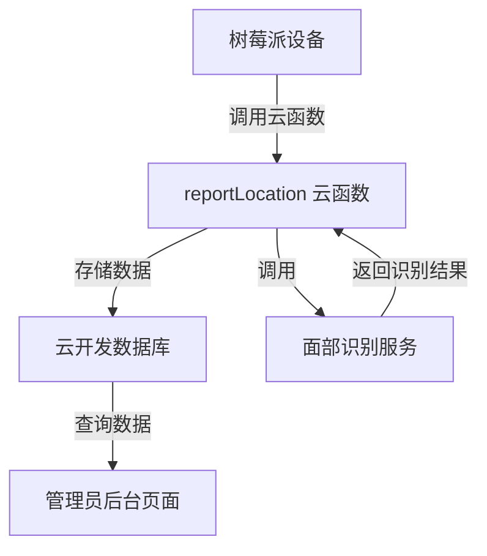

# 人员位置追踪功能设计

Feature Name: person-location-tracking
Updated: 2026-03-12

## Description

该功能实现人员位置追踪数据的采集、存储和展示。树莓派设备检测到人员后，通过云函数将数据上传至微信小程序云开发数据库，管理员可在管理后台查看各监测点的经过人员记录、时间以及按小时统计的出现频率。

## Architecture



## Components and Interfaces

### 1. 云函数: reportLocation

**功能**: 接收树莓派上报的人员位置数据

**请求参数**:
```javascript
{
  location_id: String,      // 监测点ID
  location_name: String,   // 监测点名称
  person_id: String,       // 人员ID（面部识别返回）
  person_name: String,     // 人员名称（可选）
  timestamp: Number,       // 时间戳（毫秒）
  imageData: String        // 图片Base64或云存储URL（可选）
}
```

**响应**:
```javascript
{
  success: true,
  data: {
    record_id: "xxx",
    message: "记录成功"
  }
}
```

**错误响应**:
```javascript
{
  success: false,
  error: "错误信息"
}
```

### 2. 云函数: getLocationRecords

**功能**: 获取人员位置记录（管理员用）

**请求参数**:
```javascript
{
  location_id: String,     // 可选，筛选监测点
  start_date: String,      // 可选，开始日期 YYYY-MM-DD
  end_date: String,        // 可选，结束日期 YYYY-MM-DD
  page: Number,            // 分页页码
  page_size: Number       // 每页数量
}
```

### 3. 云函数: getHourlyStatistics

**功能**: 按小时统计人员出现频率

**请求参数**:
```javascript
{
  location_id: String,     // 可选，筛选监测点
  date: String             // 日期 YYYY-MM-DD
}
```

**响应**:
```javascript
{
  success: true,
  data: [
    {
      hour: 9,
      location_name: "梅边",
      person_id: "person_001",
      person_name: "张三",
      count: 3
    },
    {
      hour: 10,
      location_name: "梅边",
      person_id: "person_001",
      person_name: "张三",
      count: 5
    }
  ]
}
```

### 4. 管理后台页面

**页面路径**: `/pages/location-records/location-records`

**功能**:
- 展示所有监测点列表
- 展示人员经过记录
- 按小时统计频率图表
- 按监测点、日期筛选

## Data Models

### person_location 集合

| 字段 | 类型 | 必填 | 说明 |
|------|------|------|------|
| _id | ObjectID | 是 | 自动生成 |
| location_id | String | 是 | 监测点ID |
| location_name | String | 是 | 监测点名称 |
| person_id | String | 是 | 人员ID |
| person_name | String | 否 | 人员名称 |
| timestamp | Date | 是 | 经过时间 |
| image_url | String | 否 | 图片云存储地址 |
| created_at | Date | 是 | 记录创建时间 |

### locations 集合

| 字段 | 类型 | 必填 | 说明 |
|------|------|------|------|
| _id | ObjectID | 是 | 自动生成 |
| location_id | String | 是 | 监测点ID |
| location_name | String | 是 | 监测点名称 |
| description | String | 否 | 描述信息 |
| created_at | Date | 是 | 创建时间 |

### persons 集合

| 字段 | 类型 | 必填 | 说明 |
|------|------|------|------|
| _id | ObjectID | 是 | 自动生成 |
| person_id | String | 是 | 人员ID |
| person_name | String | 否 | 人员名称 |
| face_data | String | 否 | 面部特征数据 |
| created_at | Date | 是 | 创建时间 |

## Database Indexes

```javascript
// person_location 集合索引
db.person_location.createIndex({ location_id: 1, timestamp: -1 })
db.person_location.createIndex({ person_id: 1, timestamp: -1 })
db.person_location.createIndex({ timestamp: 1 })
```

## Error Handling

| 场景 | 处理方式 |
|------|----------|
| 数据格式不完整 | 返回错误信息，要求补充必要字段 |
| 监测点不存在 | 自动创建新监测点 |
| 人员首次出现 | 自动创建人员记录 |
| 面部识别失败 | 存储为"未知人员"，记录原始数据 |
| 数据库写入失败 | 返回错误信息，记录日志 |
| 图片上传失败 | 记录日志，继续处理其他数据 |

## Test Strategy

### 单元测试
- 云函数输入验证
- 数据格式化逻辑
- 统计计算逻辑

### 接口测试
- reportLocation 接口正常上报
- getLocationRecords 接口筛选功能
- getHourlyStatistics 接口统计准确性

### 集成测试
- 树莓派完整上报流程
- 管理后台数据展示
- 多设备同时上报并发处理

## Implementation Tasks

### 后端任务
1. [ ] 创建 reportLocation 云函数
2. [ ] 创建 getLocationRecords 云函数
3. [ ] 创建 getHourlyStatistics 云函数
4. [ ] 创建数据库集合和索引
5. [ ] 配置云存储图片上传

### 前端任务
1. [ ] 创建 location-records 页面
2. [ ] 实现记录列表展示
3. [ ] 实现筛选功能
4. [ ] 实现统计图表
5. [ ] 添加导航入口

### 设备对接
1. [ ] 编写树莓派对接文档
2. [ ] 提供示例代码

## References

- 微信小程序云开发文档: https://developers.weixin.qq.com/miniprogram/dev/wxcloud/
- 云函数开发指南: https://developers.weixin.qq.com/miniprogram/dev/wxcloud/functions/
